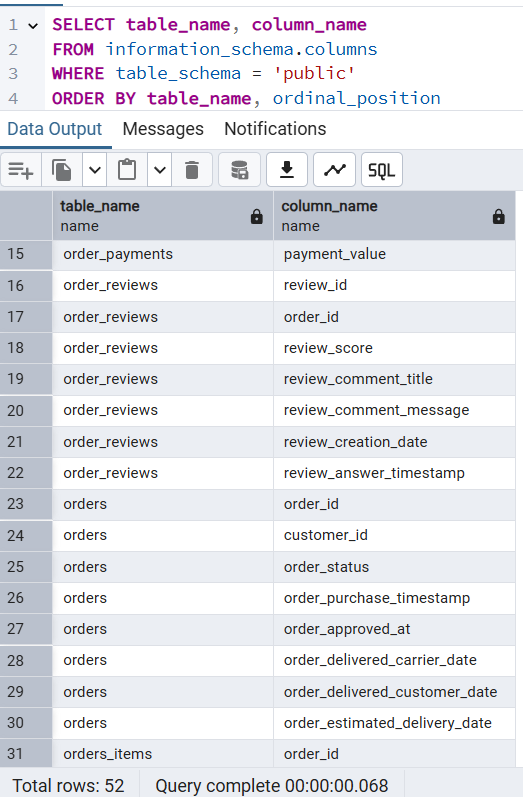
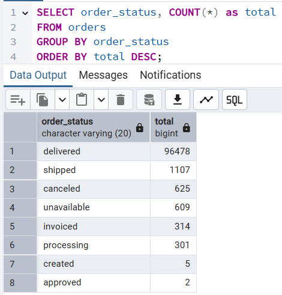
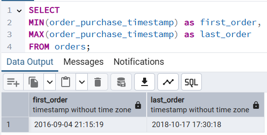
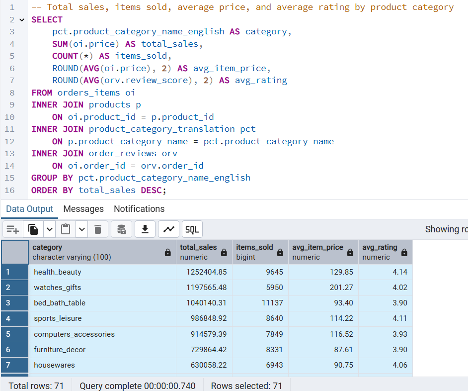
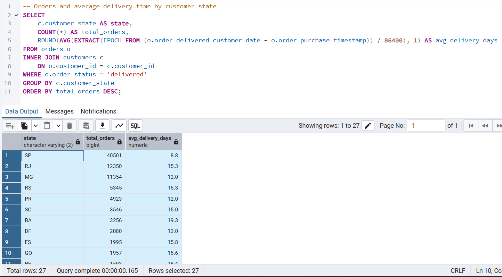
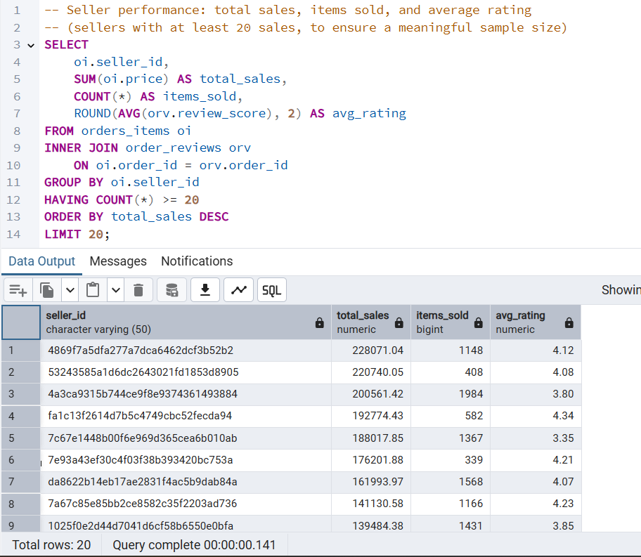
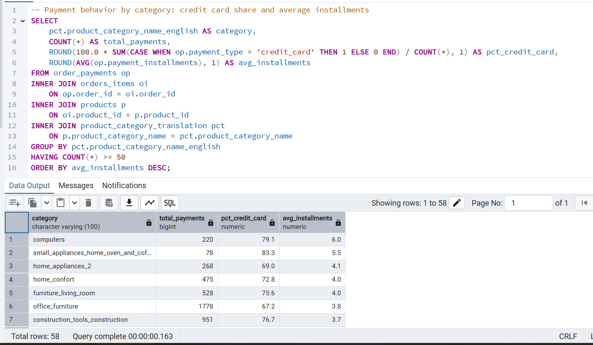

# Olist E-commerce SQL Analysis

SQL analysis of the Olist Brazilian e-commerce public dataset using PostgreSQL. Portfolio project focused on data exploration, cleaning, and answering business questions through SQL.

## Dataset

[Brazilian E-Commerce Public Dataset by Olist](https://www.kaggle.com/datasets/olistbr/brazilian-ecommerce) — 9 related tables: customers, orders, order_items, order_payments, order_reviews, products, sellers, geolocation, product_category_translation.

## Tools

- PostgreSQL + pgAdmin4 (database and query execution)
- VS Code (documentation and version control)
- Git / GitHub (repository)

## Project structure

```
olist-ecommerce-sql/
├── Queries/
│   ├── 01_exploration.sql
│   ├── 02_sales_analysis.sql
│   ├── 03_logistics_analysis.sql
│   ├── 04_seller_performance.sql
│   └── 05_payment_analysis.sql
├── Screenshots/
└── README.md
```

## Business questions

1. Which product categories have the highest sales and best customer ratings?
2. Which Brazilian states have the most orders and the longest delivery times?
3. Which sellers perform best in terms of sales and customer satisfaction?
4. How do payment methods vary across product categories?

---

## Block 1: Initial exploration (`01_exploration.sql`)

### 1. Data import verification

All 9 tables were imported into PostgreSQL. Row counts match the expected dataset totals exactly, confirming a complete import.



| Table | Rows |
|---|---|
| customers | 99,441 |
| geolocation | 1,000,163 |
| orders | 99,441 |
| order_items | 112,650 |
| order_payments | 103,886 |
| order_reviews | 99,224 |
| products | 32,951 |
| sellers | 3,095 |
| product_category_translation | 71 |

### 2. Orders by status



| Status | Count |
|---|---|
| delivered | 96,478 |
| shipped | 1,107 |
| canceled | 625 |
| unavailable | 609 |
| invoiced | 314 |
| processing | 301 |
| created | 5 |
| approved | 2 |

97% of orders are in `delivered` status. The rest did not complete their full lifecycle at the time the dataset was extracted. **Design decision:** delivery-time and customer-satisfaction analyses will be filtered to `order_status = 'delivered'`, since only these orders have a recorded delivery date.

### 3. Date range



Orders span from **2016-09-04** to **2018-10-17** (2 years and 1 month). 2016 and 2018 are partial years (4 and ~10 months respectively); only 2017 is a full calendar year. Any year-over-year sales comparison needs to account for this to avoid comparing periods of different sizes.

---

## Block 2: Business Questions

### Question 1: Which product categories have the highest sales and best customer ratings? (`02_sales_analysis.sql`)



| Category | Total Sales | Items Sold | Avg. Item Price | Avg. Rating |
|---|---|---|---|---|
| health_beauty | $1,252,404.85 | 9,645 | $129.85 | 4.14 |
| watches_gifts | $1,197,565.48 | 5,950 | $201.27 | 4.02 |
| bed_bath_table | $1,040,140.31 | 11,137 | $93.40 | 3.90 |
| sports_leisure | $986,848.92 | 8,640 | $114.22 | 4.11 |
| computers_accessories | $914,579.39 | 7,849 | $116.52 | 3.93 |

*(full results for all 71 categories in the query output)*

**Key findings:**

- `health_beauty` leads in total revenue, but `watches_gifts` earns almost as much with 40% fewer items sold, its average item price ($201.27) is roughly double that of `bed_bath_table` ($93.40), showing revenue can come from either high volume or high price per item.
- `computers` stands out as a high-value niche category: highest average item price ($1,070.99) but only 200 items sold.
- `security_and_services` has both minimal volume (2 items) and the lowest average rating (2.50)  this pattern suggests a potential problem area, though the cause would need further business context to confirm.

**Known limitation:** `review_score` is recorded at the order level, not the item level. When an order contains multiple items of the same category, its review score is counted once per item in the average, this can slightly overweight categories with multi-item orders.

### Question 2: Which Brazilian states have the most orders and the longest delivery times? (`03_logistics_analysis.sql`)



| State | Total Orders | Avg. Delivery (days) |
|---|---|---|
| SP | 40,501 | 8.8 |
| RJ | 12,350 | 15.3 |
| MG | 11,354 | 12.0 |
| RS | 5,345 | 15.3 |
| PR | 4,923 | 12.0 |
| SC | 3,546 | 15.0 |
| BA | 3,256 | 19.3 |
| DF | 2,080 | 13.0 |
| ES | 1,995 | 15.8 |
| GO | 1,957 | 15.6 |
| PE | 1,593 | 18.4 |
| CE | 1,279 | 21.3 |
| PA | 946 | 23.8 |
| MT | 886 | 18.1 |
| MA | 717 | 21.6 |
| MS | 701 | 15.6 |
| PB | 517 | 20.4 |
| PI | 476 | 19.5 |
| RN | 474 | 19.3 |
| AL | 397 | 24.5 |
| SE | 335 | 21.5 |
| TO | 274 | 17.7 |
| RO | 243 | 19.4 |
| AM | 145 | 26.4 |
| AC | 80 | 21.0 |
| AP | 67 | 27.2 |
| RR | 41 | 29.4 |

**Key findings:**

- `SP` (São Paulo) dominates in volume (40,501 orders - more than 3x the next state) and also has the fastest average delivery (8.8 days). This pattern suggests Olist's sellers/distribution infrastructure is likely concentrated in or near São Paulo, though this dataset doesn't include warehouse location data to confirm it directly.
- `RJ`, the second-highest volume state, still takes almost double the delivery time of `SP` (15.3 vs. 8.8 days) despite relative geographic proximity, reinforcing that distance from the fulfillment hub, not demand alone, drives delivery speed.
- The slowest-delivery states (`RR`: 29.4 days, `AP`: 27.2, `AM`: 26.4) are all in Brazil's North region, and also have the lowest order volumes, consistent with lower population density and greater logistical distance from major distribution centers.

### Question 3: Which sellers perform best in terms of sales and customer satisfaction? (`04_seller_performance.sql`)



Top 20 sellers by total sales (filtered to sellers with at least 20 sales, using `HAVING`, to ensure a meaningful sample size):

| Seller ID | Total Sales | Items Sold | Avg. Rating |
|---|---|---|---|
| 4869f7a5dfa277a7dca6462dcf3b52b2 | $228,071.04 | 1,148 | 4.12 |
| 53243585a1d6dc2643021fd1853d8905 | $220,740.05 | 408 | 4.08 |
| 4a3ca9315b744ce9f8e9374361493884 | $200,561.42 | 1,984 | 3.80 |
| fa1c13f2614d7b5c4749cbc52fecda94 | $192,774.43 | 582 | 4.34 |
| 7c67e1448b00f6e969d365cea6b010ab | $188,017.85 | 1,367 | 3.35 |
| 7e93a43ef30c4f03f38b393420bc753a | $176,201.88 | 339 | 4.21 |
| da8622b14eb17ae2831f4ac5b9dab84a | $161,993.97 | 1,568 | 4.07 |
| 7a67c85e85bb2ce8582c35f2203ad736 | $141,130.58 | 1,166 | 4.23 |
| 1025f0e2d44d7041d6cf58b6550e0bfa | $139,484.38 | 1,431 | 3.85 |
| 955fee9216a65b617aa5c0531780ce60 | $133,948.81 | 1,489 | 4.05 |
| 46dc3b2cc0980fb8ec44634e21d2718e | $126,166.26 | 535 | 4.18 |
| 6560211a19b47992c3666cc44a7e94c0 | $122,484.82 | 2,020 | 3.91 |
| 620c87c171fb2a6dd6e8bb4dec959fc6 | $114,015.30 | 790 | 4.22 |
| 7d13fca15225358621be4086e1eb0964 | $113,091.19 | 574 | 4.00 |
| 5dceca129747e92ff8ef7a997dc4f8ca | $110,488.73 | 342 | 3.99 |
| 1f50f920176fa81dab994f9023523100 | $107,002.21 | 1,932 | 3.98 |
| cc419e0650a3c5ba77189a1882b7556a | $106,059.06 | 1,811 | 4.07 |
| a1043bafd471dff536d0c462352beb48 | $101,454.16 | 767 | 4.19 |
| 3d871de0142ce09b7081e2b9d1733cb1 | $93,960.80 | 1,136 | 4.11 |
| edb1ef5e36e0c8cd84eb3c9b003e486d | $79,284.55 | 175 | 4.43 |

**Key findings:**

- The top seller by revenue (`4869f7a5...`) also maintains a solid 4.12 rating despite high volume, a well-rounded performer on both dimensions.
- High sales don't guarantee satisfaction: `7c67e1448b...` ranks 5th in total sales but has the lowest rating in this top 20 (3.35).
- `edb1ef5e36...` has the smallest volume in this top 20 (175 items) but the highest rating (4.43), showing smaller sellers can outperform on satisfaction even without top-tier revenue.

**Note:** seller identities in this dataset are anonymized hashes (`seller_id`); no business names are available, which is a known limitation of the publicly released Olist data.

### Question 4: How do payment methods vary across product categories? (`05_payment_analysis.sql`)



**Note on approach:** the initial version of this query ranked the single most common payment method per category — but `credit_card` ranked #1 in all 71 categories, showing no meaningful variation (credit card is simply the dominant payment method overall in Brazil). The query was revised to measure the *share* of credit card usage and the average number of installments per category instead.

| Category | Total Payments | % Credit Card | Avg. Installments |
|---|---|---|---|
| computers | 220 | 79.1% | 6.0 |
| small_appliances_home_oven_and_coffee | 78 | 83.3% | 5.5 |
| home_appliances_2 | 268 | 69.0% | 4.1 |
| watches_gifts | 6,201 | 78.3% | 3.7 |
| bed_bath_table | 11,823 | 75.8% | 3.6 |
| health_beauty | 9,972 | 75.9% | 3.0 |
| sports_leisure | 8,945 | 74.2% | 2.5 |
| electronics | 2,845 | 71.1% | 1.8 |

*(full results for all 58 qualifying categories in the query output)*

**Key findings:**

- Credit card share stays relatively stable across categories (57.5%–83.3%), confirming it's the dominant payment method overall rather than a category-specific pattern.
- Average installments vary widely (1.8–6.0) and correlate with item price: `computers` has both the highest average item price ($1,070.99, from Question 1) and the highest average installments (6.0), while `electronics` has one of the lowest average prices ($56.89) and the fewest installments (1.8) consistent, cross-validated behavior between two independent queries.

---

## Conclusions

- **Revenue leadership isn't just about volume:** `health_beauty` leads in total sales, but categories like `watches_gifts` and `computers` generate strong revenue from a higher price per item rather than high volume.
- **Logistics performance is geographically driven:** São Paulo combines the highest order volume with the fastest delivery (8.8 days), while Brazil's North region (`RR`, `AP`, `AM`) has both the lowest volume and the slowest delivery (26–29 days) consistent with distance from likely distribution hubs.
- **High revenue doesn't guarantee high satisfaction:** some top-selling sellers rate lower than smaller-volume sellers in the same top-20 ranking.
- **Payment behavior confirms price-driven consumer decisions:** credit card dominates across all categories, but installment usage varies meaningfully with product price, independently validated by the price findings in Question 1.